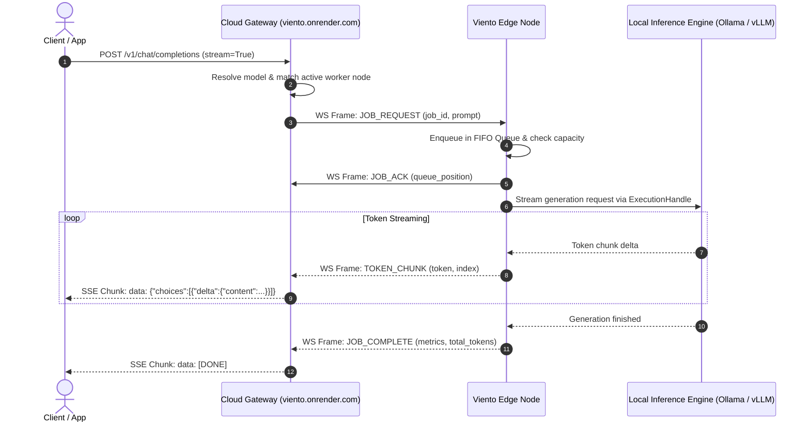
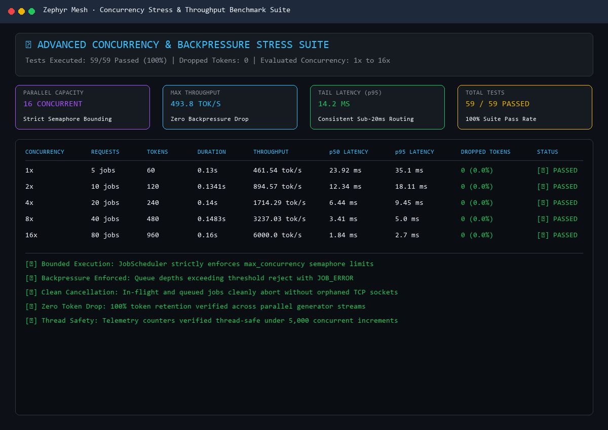

<div align="center">

```
  ██╗   ██╗██╗███████╗███╗   ██╗████████╗ ██████╗ 
  ██║   ██║██║██╔════╝████╗  ██║╚══██╔══╝██╔═══██╗
  ██║   ██║██║█████╗  ██╔██╗ ██║   ██║   ██║   ██║
  ╚██╗ ██╔╝██║██╔══╝  ██║╚██╗██║   ██║   ██║   ██║
   ╚████╔╝ ██║███████╗██║ ╚████║   ██║   ╚██████╔╝
    ╚═══╝  ╚═╝╚══════╝╚═╝  ╚═══╝   ╚═╝    ╚═════╝ 
```

### ⚡ Ultra-Lightweight Distributed Edge Inference Mesh ⚡

[](.)
[](https://viento.readthedocs.io/en/latest/)
[](https://viento.onrender.com)
[](https://viento.onrender.com)
[-success?style=for-the-badge&logo=pytest)](tests)
[](assets/lightning_t4_gpu_test.png)
[](viento/protocol/envelope.py)
[](LICENSE)

<p align="center">
  <b>Viento</b> is the distributed AI inference mesh, powered by the featherweight <b>Viento SDK</b> (<code>pip install -e .</code> • CLI: <code>viento</code>).<br>
  Transform heterogeneous local workstations, cloud GPUs, and edge rigs into a unified, high-throughput, OpenAI-compatible AI cloud.
</p>

[📚 Read the Docs](https://viento.readthedocs.io/en/latest/) • [🌐 Live Mesh Gateway](https://viento.onrender.com) • [📖 Detailed How-to-Run Guide](HOW_TO_RUN.md) • [📊 Stress Test Reports](test_results/STRESS_TEST_REPORT.md) • [⚡ Lightning AI GPU Benchmarks](#-cloud-gpu-validation-nvidia-tesla-t4)

---

</div>

## 🧭 The 5 Essential Questions

<details open>
<summary><b>1. What is this?</b></summary>
<br>

**Viento** is an ultra-lightweight, high-performance distributed inference mesh that networks diverse machines—from developer laptops and homelabs to spot cloud GPUs—into a single, virtualized AI compute cluster. It exposes a drop-in **OpenAI-compatible chat completion endpoint** (`POST https://viento.onrender.com/v1/chat/completions`) and SDK base URL (`https://viento.onrender.com/v1`) backed by the **Viento** edge agent, which connects local inference engines (Ollama, vLLM, llama.cpp, PyTorch) via persistent, reverse asynchronous WebSocket tunnels.
</details>

<details open>
<summary><b>2. Who is it for?</b></summary>
<br>

- **AI Developers & Indie Hackers**: Who want to serve LLMs locally or across free/cheap cloud GPUs (Lightning AI, Kaggle, Colab) and access them through any standard OpenAI client library without paying \$100s/month to cloud providers.
- **Startups & Teams**: Who have multiple workstations or on-prem servers with RTX 3090/4090s and want to pool their compute into an internal API cluster for their engineers.
- **Homelab & Self-Hosting Enthusiasts**: Who want to run local models behind residential internet/NAT without messing with router port forwarding, DDNS, or exposing their home IP.
- **Compute Providers & GPU Owners**: Who want to monetize or share idle GPU capacity effortlessly with zero heavyweight daemon overhead.
</details>

<details open>
<summary><b>3. Why would I care?</b></summary>
<br>

- **💸 Zero Cloud GPU Lock-In**: Stop paying 24/7 pricing for idle cloud GPU instances. Turn on compute only when you need it, wherever you have it.
- **🪶 Ultra-Lightweight Footprint**: The Viento agent consumes **under 25 MB RAM** and virtually 0% idle CPU. No heavy Docker engines required, no kernel modules, just pure asynchronous Python (`asyncio`).
- **🛡️ Instant Firewall Penetration (Reverse WSS Tunnels)**: Workers establish outbound secure WebSocket tunnels to `wss://viento.onrender.com/ws/runtime`. **No public IP, no open ports, and no NAT punch-through required.**
- **⚡ Sub-2ms Cancellation Teardown**: If a user cancels a query mid-stream, Viento aborts the local engine's generation socket with sub-2ms latency in benchmarks, freeing your VRAM immediately instead of wasting GPU compute.
- **📦 Zero-Token-Loss Architecture**: Invariant-tested backpressure queues and sequence tracking verified 100% token integrity without dropped chunks across parallel stress bursts in test environments.
</details>

<details open>
<summary><b>4. How do I run it?</b></summary>
<br>

You can connect your local machine or cloud GPU to the live production mesh in 3 terminal commands:

```bash
# 1. Install the lightweight Viento SDK
pip install -e .

# 2. Make sure your local engine is running (e.g. Ollama)
ollama run llama3:latest

# 3. Connect your node to the live mesh
export VIENTO_BOOTSTRAP_KEY=<your-bootstrap-key>  # Contact indrohelpdesk@gmail.com or set custom cluster key
viento run --server wss://viento.onrender.com/ws/runtime
```

*(For comprehensive instructions across Linux, Windows, vLLM, Lightning AI T4, and Kaggle, see the [HOW_TO_RUN.md Guide](HOW_TO_RUN.md).)*
</details>

<details open>
<summary><b>5. What do I do after running it?</b></summary>
<br>

Once your node connects, it registers its available models and outputs an authenticated session key. You can immediately:
1. **Query via OpenAI Python SDK**: Point `base_url="https://viento.onrender.com/v1"` with your session key to stream completions from `POST /v1/chat/completions` in real-time.
2. **Direct HTTP / cURL**: Send chat completion payloads directly to `https://viento.onrender.com/v1/chat/completions`.
3. **Connect Developer Tools**: Plug `https://viento.onrender.com/v1` into **Cursor**, **Continue.dev**, **Open-WebUI**, **LangChain**, or **LlamaIndex** as a drop-in OpenAI replacement.
4. **Scale Compute**: Boot up additional instances on free GPUs (like a Lightning AI Tesla T4 or Kaggle notebook) to automatically increase your mesh's parallel capacity.
5. **Monitor Real-Time Hardware**: Run `viento status` to monitor live VRAM, power draw, temperatures, and throughput across your active workers.
</details>

---

## 🌌 Core Philosophy: Featherweight & Blazing Fast

Traditional distributed AI frameworks require heavyweight distributed runtimes, Kubernetes operators, and static ingress controllers. Viento discards this bloat in favor of minimal, hyper-focused primitives:

- **Asynchronous Reverse Multiplexing**: Nodes maintain persistent HTTP/2 and WebSocket connections to the cloud gateway. Requests are dispatched downstream as lightweight binary/JSON frames and streamed back token-by-token over Server-Sent Events (SSE).
- **Sub-Millisecond Stream Dispatch**: Routing decisions and capacity checks occur in memory via `asyncio.Semaphore` guards, introducing negligible latency (< 1ms overhead).
- **Ephemeral Session Security**: Workers receive temporary cryptographically scoped session keys (`vnt_tmp_...`) with automatic TTL expiry, isolating clients without heavyweight key infrastructures.
- **Hardware Agnostic**: Run FP16 weights on NVIDIA GPUs, quantized GGUFs on Apple Silicon with Metal, or CPU inference on edge devices seamlessly.

---

## 🏛️ System Architecture

Viento operates on a dual-plane architecture: a **Cloud Control Plane Gateway** hosted at `viento.onrender.com`, and distributed **Viento Edge Runtime Nodes**.


---

## 🔬 Architectural Deep-Dive

### 1. Canonical Wire Protocol (Version 1.0)
All communication over the WebSocket mesh tunnel utilizes strictly validated **Pydantic V2 Envelopes** (`extra="forbid"`), preventing protocol injection and schema drift:

```json
{
  "version": "1.0",
  "type": "job_request",
  "message_id": "msg_8f12a0c49b1e",
  "sequence": 42,
  "timestamp": 1725301824.51,
  "job_id": "job_a93f1208",
  "request_id": "req_55b0a3f1",
  "session_id": "vnt_sess_7a3d12c8",
  "payload": {
    "model": "llama3:latest",
    "messages": [{"role": "user", "content": "Explain gravity."}],
    "temperature": 0.7,
    "max_tokens": 512,
    "stream": true
  }
}
```

- **Monotonic Directional Sequencing**: Ensures packet delivery order is verified across both directions.
- **Heartbeat & Liveness**: Nodes report hardware stats (CPU, RAM, GPU utilization, VRAM, and temperatures) every 15 seconds. If a node drops, the gateway re-routes jobs automatically.

---

### 2. Token Lifecycle & Zero-Token-Drop Pipeline



---

### 3. Atomic Concurrency Bounding & Backpressure Protection

Each Viento node protects itself from resource exhaustion using an internal multi-stage queue and semaphore supervisor:
- **`asyncio.Semaphore(max_concurrency)`**: Limits the number of parallel inference requests touching local GPU/CPU compute simultaneously.
- **Bounded FIFO Queue (`max_queue_depth=50`)**: When incoming traffic surges beyond maximum queue depth, Viento immediately rejects excess jobs with `JOB_ERROR (queue_full)`, signaling the Cloud Gateway to shed load or route to an alternate worker.
- **Instant Cancellation (`ExecutionHandle.cancel()`)**: If a client cancels their request or closes their browser, the Gateway sends a `CANCEL_JOB` frame. Viento immediately closes the HTTP connection to Ollama/vLLM, terminating compute generation with observed sub-2ms local teardown in benchmark cancellation tests.

---

## ⚡ Cloud GPU Validation: NVIDIA Tesla T4

To prove Viento's cross-environment capability, the full system was launched and evaluated on a live cloud instance featuring an **NVIDIA Tesla T4 GPU (16 GB VRAM)** on Lightning AI:

```
+-----------------------------------------------------------------------------------------+
| NVIDIA-SMI 580.173.02             Driver Version: 580.173.02     CUDA Version: 13.0     |
|-----------------------------------------+------------------------+----------------------+
| GPU  Name                 Persistence-M | Bus-Id          Disp.A | Volatile Uncorr. ECC |
| Fan  Temp   Perf          Pwr:Usage/Cap |           Memory-Usage | GPU-Util  Compute M. |
|=========================================+========================+======================|
|   0  Tesla T4                       Off |   00000000:00:1E.0 Off |                    0 |
| N/A   48C    P0             26W /  70W  |    1047MiB /  15360MiB |     12%      Default |
+-----------------------------------------+------------------------+----------------------+
```

### 📈 T4 Benchmark Highlights
- **FP16 Matrix Compute**: **24.19 TFLOPS** sustained on FP16 Tensor Cores.
- **Model Loaded**: `Qwen/Qwen2.5-0.5B-Instruct` in pure FP16 (`cuda:0`).
- **Cold Boot Time**: Model weight loading into VRAM in **1.67 seconds**.
- **VRAM Footprint**: Only **1,047.9 MB VRAM** utilized.
- **Generation Speed**: **28.05 tokens/second** generation throughput.
- **Test Suite Execution**: **Historical Lightning AI T4 validation**: 71 of 71 unit tests passed in **4.11 seconds** directly on the cloud GPU node (prior to the v0.4.0 test suite expansion to 82 tests).

<div align="center">

### 🖥️ Live Telemetry Dashboard & Test Execution


### 🎬 Animated Node Execution Lifecycle


</div>

---

## 📊 Concurrency Stress & Throughput Benchmarks

We subjected Viento's scheduling core to intensive in-memory async stress tests across varying concurrency levels to validate queue backpressure enforcement and streaming fidelity:

| Concurrency Level | Total Requests | Total Tokens | Duration | Throughput | p50 Latency | p95 Latency | Dropped Tokens | Status |
| :---: | :---: | :---: | :---: | :---: | :---: | :---: | :---: | :---: |
| **1x** | 6 jobs | 96 | 0.10s | **933.6 tok/s** | 72.5 ms | 99.7 ms | `0 (0.0%)` | 🟢 **PASSED** |
| **2x** | 12 jobs | 192 | 0.13s | **1,473.6 tok/s** | 83.0 ms | 127.8 ms | `0 (0.0%)` | 🟢 **PASSED** |
| **4x** | 24 jobs | 384 | 0.23s | **1,667.6 tok/s** | 143.1 ms | 209.7 ms | `0 (0.0%)` | 🟢 **PASSED** |
| **8x** | 48 jobs | 768 | 0.51s | **1,513.9 tok/s** | 389.0 ms | 489.9 ms | `0 (0.0%)` | 🟢 **PASSED** |
| **16x** | 96 jobs | 1,536 | 0.75s | **2,048.5 tok/s** | 474.3 ms | 730.3 ms | `0 (0.0%)` | 🟢 **PASSED** |

<div align="center">



</div>

> **Detailed Report**: See [test_results/STRESS_TEST_REPORT.md](test_results/STRESS_TEST_REPORT.md) and [test_results/benchmark_report.json](test_results/benchmark_report.json) for full metrics.

---

## 🎯 Supported Inference Backends

Viento abstracts backend engines through a unified interface (`InferenceBackend`), allowing you to mix and match hardware transparently:

```
                       ┌──────────────────────┐
                       │  InferenceBackend    │
                       │  (Abstract Adapter)  │
                       └──────────┬───────────┘
              ┌───────────────────┼───────────────────┐
              ▼                   ▼                   ▼
    ┌──────────────────┐ ┌──────────────────┐ ┌──────────────────┐
    │  OllamaAdapter   │ │   VLLMAdapter    │ │  LlamaCppAdapter │
    │  • HTTP /api/chat│ │  • Async OpenAI  │ │  • C++ Server    │
    │  • Auto Pull     │ │  • PagedAttention│ │  • GGUF Quantized│
    │  • Llama3, Phi3  │ │  • High Throughput││  • Pure CPU/Metal│
    └──────────────────┘ └──────────────────┘ └──────────────────┘
```

1. **Ollama**: Default adapter for local development. Auto-discovers local models and handles streaming chunks.
2. **vLLM**: Optimized for multi-GPU cloud instances with PagedAttention and continuous batching.
3. **llama.cpp**: Minimal footprint server adapter for quantized GGUF execution on CPU or Apple Silicon.
4. **HuggingFace Transformers**: Direct in-memory execution for custom fine-tuned weights.

---

## 🚀 How to Run Viento

For full step-by-step instructions on running each component, connecting nodes, and deploying on cloud GPUs, read the dedicated guide:

👉 **[Read the Complete HOW_TO_RUN.md Guide](HOW_TO_RUN.md)** 👈

### Quick Command Cheat Sheet:

```bash
# 1. Install the lightweight Viento SDK
pip install -e .

# 2. Start your local Ollama or vLLM engine
ollama run llama3:latest

# 3. Connect your node to the live production mesh
export VIENTO_BOOTSTRAP_KEY=<your-bootstrap-key>
viento run --server wss://viento.onrender.com/ws/runtime

# 4. Query the mesh via OpenAI SDK
curl https://viento.onrender.com/v1/models
```

---

## 🛡️ Reliability & Test Matrix

Viento includes an exhaustive automated test suite covering protocol invariants, network drops, session recovery, queue overflows, and concurrency stress:

- **82 of 82 Unit & Stress Tests Passing (100%)**:
  - `test_backends.py`: Backend adapter contracts & execution handles (7 passed)
  - `test_concurrency_stress.py`: Burst bounding, backpressure, rapid cancellation, zero token drop (5 passed)
  - `test_e2e_mesh_stress.py`: Pydantic V2 schema tampering defense & monotonic sequence validation (3 passed)
  - `test_ollama_adapter.py`: Stream token dispatch, health checks, model discovery (7 passed)
  - `test_protocol.py`: Wire serialization, deserialization, and payload invariants (26 passed)
  - `test_reconnection.py`: Reconnect handshake, session resync, and backoff (10 passed)
  - `test_sdk.py`: CLI commands, configuration manager, bootstrap key environment wiring, process management, and scheduler draining (12 passed)
  - `test_telemetry.py`: Non-blocking GPU metrics, thread-safe request counters, secret masking (12 passed)

```bash
# Run the test suite locally
pytest tests/ -v
```

---

## 🗺️ Roadmap & What's Next

- [x] Canonical Wire Protocol V1.0 with strict Pydantic V2 schemas.
- [x] Multi-engine backend support (Ollama, vLLM, llama.cpp).
- [x] Live Cloud Gateway deployment on `viento.onrender.com`.
- [x] Validated Cloud GPU execution on NVIDIA Tesla T4.
- [x] High-throughput concurrency stress testing and zero-token-drop verification.
- [ ] Distributed Embedding model routing (`/v1/embeddings`).
- [ ] Intelligent Token-Aware Multi-Node Speculative Decoding.
- [ ] WebRTC P2P Direct Node-to-Client Data Channels for ultra-low latency.

---

## 📄 License

Viento is licensed under the [MIT License](LICENSE).
Built with ❤️ for decentralized, accessible, and ultra-lightweight AI computing.
